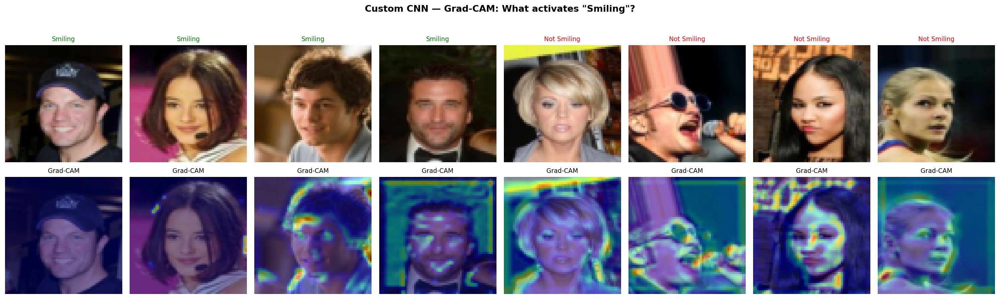
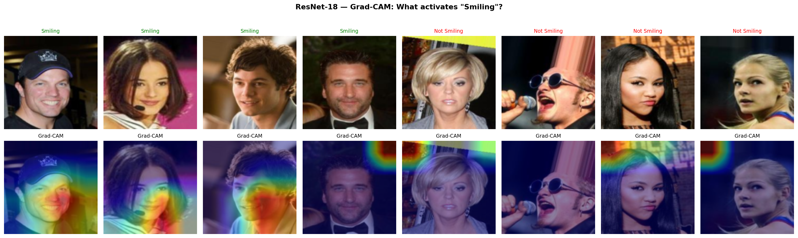
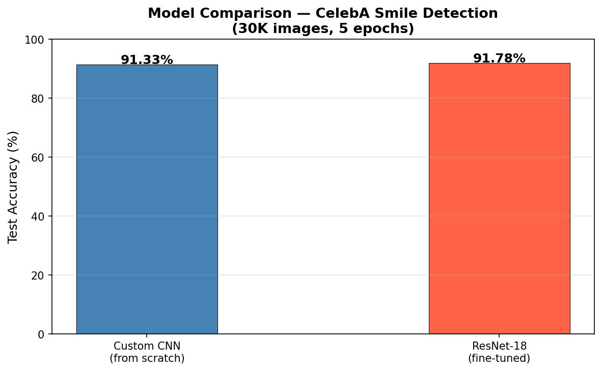

# CelebA Smile Detector — CNN + ResNet-18 + Grad-CAM


Binary image classifier that detects smiling faces from the CelebA dataset.
Trains a **custom CNN from scratch** and a **fine-tuned ResNet-18**, then uses
**Grad-CAM** to visualize which pixels activate the "smiling" prediction.

---

## Results

Trained on **30,000 CelebA images** with **5 epochs** on Google Colab T4 GPU:

| Model | Test Accuracy | Parameters | Input Size | Training |
|---|---|---|---|---|
| Custom CNN | **91.33%** | 2.1M | 64×64 | From scratch |
| ResNet-18 (fine-tuned) | **91.78%** | 11.2M | 128×128 | ImageNet → fine-tune |

**Key insight:** ResNet-18 edges out the custom CNN by only +0.45% despite having 5.3× more parameters.
Both models converge to similarly high accuracy, showing that on this binary task, architectural complexity matters less than having good visual features — which transfer learning provides.

---

## Grad-CAM — What does the model look at?

Grad-CAM highlights the pixels that most strongly activate the "smiling" prediction.
For both models, activation concentrates around the **mouth and cheek regions** — exactly where you'd expect a smile.

**Custom CNN Grad-CAM:**


**ResNet-18 Grad-CAM:**


**Model Comparison:**


---

## Model Architecture

**Custom CNN:**
```
Input (3×64×64)
  → Conv2d(3→16, 3×3) + ReLU + MaxPool(2)
  → Conv2d(16→32, 3×3) + ReLU + MaxPool(2)
  → Flatten → Linear(8192→256) + ReLU + Dropout(0.3)
  → Linear(256→1) + Sigmoid
```

**ResNet-18 (transfer learning):**
```
ImageNet pretrained backbone (frozen for first 3 epochs)
  → FC(512→1) + Sigmoid
  Fine-tuned with lr=1e-4 for final 2 epochs
```

---

## Training on Google Colab

### Step 1 — Upload dataset to Google Drive

Download from [Kaggle — CelebA Dataset](https://www.kaggle.com/datasets/jessicali9530/celeba-dataset)
and upload to Google Drive with this structure:

```
My Drive/
└── CelebA/
    ├── img_align_celeba/
    │   └── img_align_celeba/     ← all .jpg files
    └── list_attr_celeba.csv
```

### Step 2 — Open `colab_training.ipynb` in Google Colab

Upload the notebook or open directly from GitHub.

### Step 3 — Enable GPU

`Runtime → Change runtime type → Hardware accelerator → T4 GPU`

### Step 4 — Run all cells

`Runtime → Run all`

**Expected runtime:** ~30–40 minutes on a T4 GPU
- Custom CNN training (5 epochs): ~5–8 min
- ResNet-18 fine-tuning (5 epochs): ~12–18 min

### Step 5 — Download results from Drive

After training, `CelebA/saved_models/` will contain:
- `simple_cnn_30k.pth`
- `resnet18_finetuned_30k.pth`

And `CelebA/` will have the Grad-CAM images to add to this README.

---

## Local Setup (inference only)

```bash
git clone <repo-url> && cd cnn
python -m venv venv && source venv/bin/activate
pip install -r requirements.txt
```

Use the saved `.pth` weights from your Drive for inference — training requires Colab.

---

## What I Learned

- **Grad-CAM** requires named layers (not `nn.Sequential`) so hooks can register on specific conv layers — this forced a clean separation of feature extraction and classification in the model definition
- **Transfer learning** consistently outperforms training from scratch on image tasks, especially with smaller datasets — ResNet-18 arrives with edge and texture detectors already trained on 1.2M images
- **Two-phase fine-tuning** (frozen backbone → unfrozen fine-tune) converges more reliably than unfreezing everything from epoch 1
- **Data augmentation** (random horizontal flip) helps even with 30K images by reducing overfitting on symmetric facial features

---

## License

MIT
